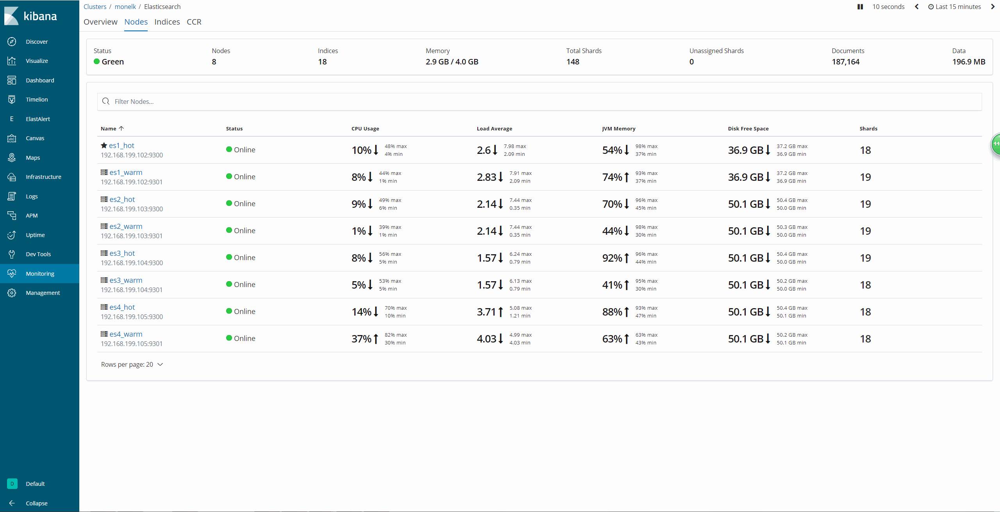
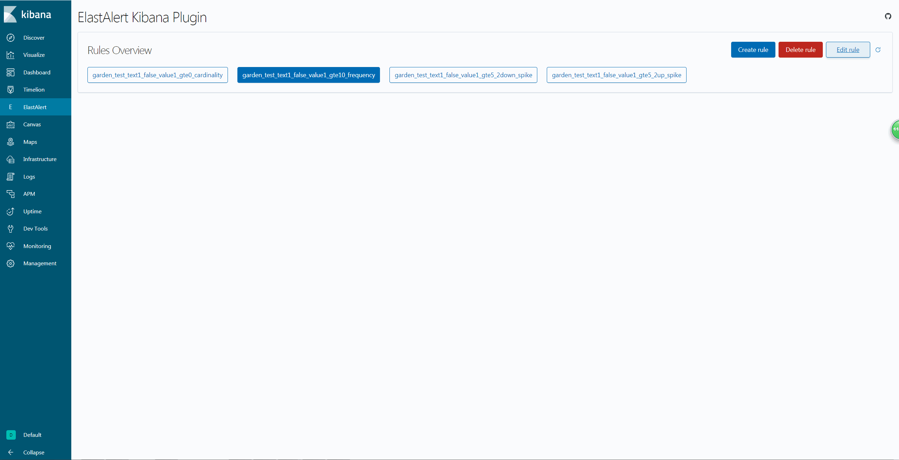

# es_cluster
自动化部署、扩容、升级ES等分布式集群

> **本文主要向大家介绍一种在生产环境下如何自动化部署ES等分布式集群的方法，通过该方法可以快速地对多种分布式集群进行部署、扩容、升级、日常维护等运维操作。**

## 集群界面

### ES Cluster


### SDC pipeline


### Elastalert


## 部署准备
- 安装好系统及基本软件，如：supervisor, jdk, pip, python2.7及相关依赖包(curator)
- 设置好核心参数（根据各产品的官方要求设置）
- 各节点部署用户间建立好节点间互信
- 准备好配置文件并放置在${HOME}/conf下，分模块目录存放
- 将下载好的软件包放置在${HOME}/install下
- 由于nginx, elastalert和elastalert-server为定制开发版，因此不能直接自动安装，需手工安装
- 对于SDC,kafka,zookeeper,redis集群通常会单独部署，这里仅仅作简单演示，表明同样可以采用本方法进行自动部署
- ${HOME}/data/sdc下为演示用到的pipeline

## 目录结构
用户目录下存放各子目录的功能和内容

- **bin**

  存放在整个集群环境运行所需的各种命令脚本

- **conf**

  各服务、组件的配置文件；按服务、组件分子目录存放，事先准备好；
  
  该目录下的*.list文件定义了哪些节点、启动哪些服务以及运行角色；
  
  \*.list文件里面存储的是主机名列表，运行主机如果在列表中就会启动相关服务，例如：
  ```bash
  cat kafka.list
  es1
  es2
  es3
  ```
  则表明kafka服务会在es1,es2,es3节点启动
  ```bash
  cat elasticsearch_master.list
  es1
  es2
  es3
  ```
  则表明elasticsearch的master节点会运行在es1,es2,es3节点

- **data**

  各服务、组件的中间运行态数据；按服务、组件分子目录存放

- **log**

  各服务、组件的运行日志信息；按服务、组件分子目录存放

- **install**

  各服务、组件的标准安装包，从各产品的官方网站下载

- **software**

  各服务、组件的运行程序，由各安装包安装后产生；按服务、组件分子目录存放
  
```bash
├── bin
│   ├── clean_log.sh
│   ├── clean_tmp.sh
│   ├── cluster.sh
│   ├── elastalert_leader.sh
│   ├── elastalert.sh
│   ├── elasticsearch_hot.sh
│   ├── elasticsearch_warm.sh
│   ├── filebeat.sh
│   ├── h2w.sh
│   ├── heartbeat.sh
│   ├── initnode.sh
│   ├── kafka.sh
│   ├── kibana.sh
│   ├── metricbeat.sh
│   ├── nginx.sh
│   ├── open_closed_index.sh
│   ├── packetbeat.sh
│   ├── pre_create_index.sh
│   ├── redis.sh
│   ├── sdc_pipeline.sh
│   ├── sdc.sh
│   ├── supervisor.sh
│   ├── sync.sh
│   └── zookeeper.sh
├── conf
│   ├── cluster.list
│   ├── elastalert
│   ├── elastalert.list
│   ├── elastalert-server
│   ├── elasticsearch
│   ├── elasticsearch_data.list
│   ├── elasticsearch_hot.list
│   ├── elasticsearch_master.list
│   ├── elasticsearch_warm.list
│   ├── filebeat
│   ├── filebeat.list
│   ├── heartbeat
│   ├── heartbeat.list
│   ├── kafka
│   ├── kafka.list
│   ├── kibana
│   ├── kibana.list
│   ├── metricbeat
│   ├── metricbeat.list
│   ├── nginx
│   ├── nginx.list
│   ├── packetbeat
│   ├── packetbeat.list
│   ├── redis
│   ├── redis.list
│   ├── sdc
│   ├── sdc.list
│   ├── supervisor
│   └── zookeeper.list
├── data
│   └── sdc
├── install
│   ├── elastalert-kibana-plugin-1.0.1-6.4.2.zip
│   ├── elastalert-kibana-plugin-1.0.3-6.7.0.zip
│   ├── elasticsearch-6.4.2.tar.gz
│   ├── elasticsearch-6.7.0.tar.gz
│   ├── elasticsearch-analysis-ik-6.4.2.zip
│   ├── elasticsearch-analysis-ik-6.7.0.zip
│   ├── filebeat-6.4.2-linux-x86_64.tar.gz
│   ├── filebeat-6.7.0-linux-x86_64.tar.gz
│   ├── files.txt
│   ├── heartbeat-6.4.2-linux-x86_64.tar.gz
│   ├── heartbeat-6.7.0-linux-x86_64.tar.gz
│   ├── jdk-10.0.2_linux-x64_bin.tar.gz
│   ├── jdk-11.0.1_linux-x64_bin.tar.gz
│   ├── kafka_2.11-1.1.0.tgz
│   ├── kafka_2.11-2.1.1.tgz
│   ├── kibana-6.4.2-linux-x86_64.tar.gz
│   ├── kibana-6.7.0-linux-x86_64.tar.gz
│   ├── metricbeat-6.4.2-linux-x86_64.tar.gz
│   ├── metricbeat-6.7.0-linux-x86_64.tar.gz
│   ├── openresty-1.13.6.2
│   ├── openresty-1.13.6.2.tar.gz
│   ├── openssl-1.1.1
│   ├── openssl-1.1.1.tar.gz
│   ├── packetbeat-6.4.2-linux-x86_64.tar.gz
│   ├── packetbeat-6.7.0-linux-x86_64.tar.gz
│   ├── pcre-8.42
│   ├── pcre-8.42.tar.gz
│   ├── streamsets-datacollector-core-3.1.0.tgz
│   ├── streamsets-datacollector-core-3.7.2.tgz
│   ├── v5.5.4.tar.gz
│   └── v5.6.0.tar.gz
├── log
├── README.md
├── software
│   ├── elastalert
│   ├── elastalert-server
│   ├── nginx
│   └── redis
```

## 重要命令
- **initnode.sh**
  
  初始安装或升级安装一个节点上所有服务、组件。在运行过程中会询问需要安装的软件版本并进行安装包的检查，如果对于版本无需安装保持为空回车即可
  
- **各服务脚本**
  
  服务层面控制，负责自身服务的启停、状态监控，依据*.list来设置合理的运行环境、动态修改配置文件等
  
  例如：
  
  elasticsearch_hot.sh: Usage elasticsearch_hot.sh {start|stop|restart|status}
  
  sdc.sh: Usage sdc.sh {start|stop|restart|status}
  
  kafka.sh: Usage kafka.sh {start|stop|restart|status}
  
  nginx.sh: Usage nginx.sh {start|stop|restart|status|reload}

- **supervisor.sh**
  
  节点层面的服务控制，在节点范围内对服务进行启停、状态监控，节点服务退出自动拉起
  
  supervisor.sh: Usage supervisor.sh {init|start|stop|shutdown|restart|status}
  
  supervisor.sh init 启动supervisord服务并启动其管理的所有服务
  
  supervisor.sh shutdown 关闭supervisord服务
  
  supervisor.sh start|stop||restart|status 对指定的服务进行启动、停止、重启、状态查看

- **cluster.sh**

  集群层面的服务控制，在整个集群范围内对服务进行启停、状态监控
  
  cluster.sh: Usage cluster.sh -h cluster.list command {init|start|stop|shutdown|restart|status}
  
  cluster.list为定义整个集群的主机列表，一般存放在${HOME}/conf下
  
  command为supervisor.sh或者各服务的控制命令
  
  例如：
  
  需要查看整个集群的服务运行状态cluster.sh -h ~/conf/cluster.list supervisor.sh status
  
  需要查看整个集群的Elasticsearch hot节点服务状态cluster.sh -h ~/conf/cluster.list elasticsearch_hot.sh status
  
  启动整个集群 cluster.sh -h ~/conf/cluster.list supervisor.sh init
  
  停止整个集群 cluster.sh -h ~/conf/cluster.list supervisor.sh shutdown

- **sync.sh**

  将当前节点的数据完全同步到集群中的其他节点，保证节点间信息完全同步。用于扩容、升级、信息同步等场景
  
  Usage sync.sh {sdc_pipeline|nginx|elastalert|curator|upgrade|services}
  
  sync.sh sdc_pipeline|nginx|elastalert|curator 只同步指定的部分组件
  
  sync.sh upgrade 在集群升级中使用，旧的运行包会被完全替换
  
  sync.sh services 在扩容或配置修改后同步时使用，旧的配置会被更新


## 操作流程
- 部署、升级场景：选择集群中任意一个节点作为首节点（初始节点），使用initnode.sh对该节点进行安装、升级，验证该节点所有服务是否全部正常
- 变更场景：选择集群中任意一个节点作为首节点（变更节点），对配置进行修改，验证该节点所有服务是否全部正常
- 完成上面两个场景处理后，在首节点上执行sync.sh，采用轮转的方式将首节点的信息完全同步到集群中其他节点，完成一个自动再处理下一个

> 部署：
```bash
在节点es1运行
initnode.sh 
Do you confirm to initialize the present node? (Y/N)y
Which elasticsearch version will you use? 6.4.2
Which elasticsearch curator version will you use? 5.5.4
Which elastalert kibana plugin version will you use? 1.0.1
Which jdk version for elasticsearch will you use? 10.0.2
Which kafka version will you use? 1.1.0
Which streamsets data collector version will you use? 3.1.0
... ...
-> Downloading file:///home/zhanyl/install/elasticsearch-analysis-ik-6.4.2.zip
[=================================================] 100%   
@@@@@@@@@@@@@@@@@@@@@@@@@@@@@@@@@@@@@@@@@@@@@@@@@@@@@@@@@@@
@     WARNING: plugin requires additional permissions     @
@@@@@@@@@@@@@@@@@@@@@@@@@@@@@@@@@@@@@@@@@@@@@@@@@@@@@@@@@@@
* java.net.SocketPermission * connect,resolve
See http://docs.oracle.com/javase/8/docs/technotes/guides/security/permissions.html
for descriptions of what these permissions allow and the associated risks.

Continue with installation? [y/N]y
... ...
Switch to another terminal and to confirm the configuration, then press [y|Y] to continue ... (Y/N)y
{
  "acknowledged" : true,
  "persistent" : { },
  "transient" : { }
}
{
  "acknowledged" : true
}
```
> 扩容：
```bash
在节点es1运行
sync.sh services
Waiting for sync all services in cluster ...
{
  "acknowledged" : true
}
Shutdown service on es2 ...
[1] 11:45:48 [FAILURE] es2 Exited with error code 127
Stderr: bash: /home/zhanyl/bin/supervisor.sh: No such file or directory
[1] 11:46:19 [FAILURE] es2 Exited with error code 1
Stderr: chown: cannot access '/home/zhanyl/software/packetbeat/packetbeat': No such file or directory
[1] 11:46:19 [FAILURE] es2 Exited with error code 1
Stderr: chown: cannot access '/home/zhanyl/conf/packetbeat/*.yml': No such file or directory
Synchronizing .bashrc to es2 ...
[1] 11:46:20 [SUCCESS] es2
Synchronizing .viminfo to es2 ...
[1] 11:46:21 [SUCCESS] es2
Synchronizing bin to es2 ...
[1] 11:46:22 [SUCCESS] es2
Synchronizing conf to es2 ...
[1] 11:46:24 [SUCCESS] es2
Synchronizing data/sdc to es2 ...
[1] 11:46:26 [SUCCESS] es2
Synchronizing install to es2 ...
[1] 11:46:27 [SUCCESS] es2
Synchronizing software to es2 ...
[1] 11:47:00 [SUCCESS] es2
[1] 11:48:51 [SUCCESS] es2
[1] 11:48:52 [SUCCESS] es2
[1] 11:48:53 [SUCCESS] es2
[1] 11:48:53 [SUCCESS] es2
[1] 11:48:54 [SUCCESS] es2
Startup service on es2 ...
[1] 11:48:55 [SUCCESS] es2
{
  "acknowledged" : true
}
{
  "acknowledged" : true
}
Shutdown service on es3 ...
[1] 11:49:29 [FAILURE] es3 Exited with error code 127
Stderr: bash: /home/zhanyl/bin/supervisor.sh: No such file or directory
[1] 11:50:00 [FAILURE] es3 Exited with error code 1
Stderr: chown: cannot access '/home/zhanyl/software/packetbeat/packetbeat': No such file or directory
[1] 11:50:01 [FAILURE] es3 Exited with error code 1
Stderr: chown: cannot access '/home/zhanyl/conf/packetbeat/*.yml': No such file or directory
Synchronizing .bashrc to es3 ...
[1] 11:50:01 [SUCCESS] es3
Synchronizing .viminfo to es3 ...
[1] 11:50:03 [SUCCESS] es3
Synchronizing bin to es3 ...
[1] 11:50:04 [SUCCESS] es3
Synchronizing conf to es3 ...
[1] 11:50:06 [SUCCESS] es3
Synchronizing data/sdc to es3 ...
[1] 11:50:08 [SUCCESS] es3
Synchronizing install to es3 ...
[1] 11:50:09 [SUCCESS] es3
Synchronizing software to es3 ...
[1] 11:52:01 [SUCCESS] es3
[1] 11:53:55 [SUCCESS] es3
[1] 11:53:55 [SUCCESS] es3
[1] 11:53:56 [SUCCESS] es3
[1] 11:53:57 [SUCCESS] es3
[1] 11:53:57 [SUCCESS] es3
Startup service on es3 ...
[1] 11:53:58 [SUCCESS] es3
{
  "acknowledged" : true
}
{
  "acknowledged" : true
}
Shutdown service on es4 ...
[1] 11:54:33 [FAILURE] es4 Exited with error code 127
Stderr: bash: /home/zhanyl/bin/supervisor.sh: No such file or directory
[1] 11:55:04 [FAILURE] es4 Exited with error code 1
Stderr: chown: cannot access '/home/zhanyl/software/packetbeat/packetbeat': No such file or directory
[1] 11:55:05 [FAILURE] es4 Exited with error code 1
Stderr: chown: cannot access '/home/zhanyl/conf/packetbeat/*.yml': No such file or directory
Synchronizing .bashrc to es4 ...
[1] 11:55:06 [SUCCESS] es4
Synchronizing .viminfo to es4 ...
[1] 11:55:08 [SUCCESS] es4
Synchronizing bin to es4 ...
[1] 11:55:09 [SUCCESS] es4
Synchronizing conf to es4 ...
[1] 11:55:11 [SUCCESS] es4
Synchronizing data/sdc to es4 ...
[1] 11:55:14 [SUCCESS] es4
Synchronizing install to es4 ...
[1] 11:55:16 [SUCCESS] es4
Synchronizing software to es4 ...
[1] 11:57:14 [SUCCESS] es4
[1] 11:59:17 [SUCCESS] es4
[1] 11:59:18 [SUCCESS] es4
[1] 11:59:18 [SUCCESS] es4
[1] 11:59:19 [SUCCESS] es4
[1] 11:59:19 [SUCCESS] es4
Startup service on es4 ...
[1] 11:59:20 [SUCCESS] es4
{
  "acknowledged" : true
}
```

> 升级：
```bash
在节点es1运行
initnode.sh
Do you confirm to initialize the present node? (Y/N)y
Which elasticsearch version will you use? 6.7.0
Which elasticsearch curator version will you use? 5.6.0
Which elastalert kibana plugin version will you use? 1.0.3
Which jdk version for elasticsearch will you use? 11.0.1
Which kafka version will you use? 2.1.1
Which streamsets data collector version will you use? 3.7.2
... ...
-> Downloading file:///home/zhanyl/install/elasticsearch-analysis-ik-6.7.0.zip
[=================================================] 100%   
@@@@@@@@@@@@@@@@@@@@@@@@@@@@@@@@@@@@@@@@@@@@@@@@@@@@@@@@@@@
@     WARNING: plugin requires additional permissions     @
@@@@@@@@@@@@@@@@@@@@@@@@@@@@@@@@@@@@@@@@@@@@@@@@@@@@@@@@@@@
* java.net.SocketPermission * connect,resolve
See http://docs.oracle.com/javase/8/docs/technotes/guides/security/permissions.html
for descriptions of what these permissions allow and the associated risks.

Continue with installation? [y/N]y
... ...
Switch to another terminal and to confirm the configuration, then press [y|Y] to continue ... (Y/N)y
{
  "acknowledged" : true,
  "persistent" : { },
  "transient" : { }
}
{
  "acknowledged" : true
}

sync.sh upgrade
Waiting for sync all services in cluster ...
{
  "acknowledged" : true
}
Shutdown service on es2 ...
[1] 14:07:12 [SUCCESS] es2
Shut down
[1] 14:07:43 [SUCCESS] es2
[1] 14:07:43 [SUCCESS] es2
Synchronizing .bashrc to es2 ...
[1] 14:07:44 [SUCCESS] es2
Synchronizing .viminfo to es2 ...
[1] 14:07:45 [SUCCESS] es2
Synchronizing bin to es2 ...
[1] 14:07:46 [SUCCESS] es2
Synchronizing conf to es2 ...
[1] 14:07:48 [SUCCESS] es2
Synchronizing data/sdc to es2 ...
[1] 14:07:49 [SUCCESS] es2
[1] 14:07:50 [SUCCESS] es2
Synchronizing install to es2 ...
[1] 14:07:51 [SUCCESS] es2
Synchronizing software to es2 ...
[1] 14:07:52 [SUCCESS] es2
[1] 14:07:54 [SUCCESS] es2
[1] 14:09:37 [SUCCESS] es2
[1] 14:09:38 [SUCCESS] es2
[1] 14:09:38 [SUCCESS] es2
[1] 14:09:39 [SUCCESS] es2
[1] 14:09:40 [SUCCESS] es2
Startup service on es2 ...
[1] 14:09:40 [SUCCESS] es2
{
  "acknowledged" : true
}
{
  "acknowledged" : true
}
Shutdown service on es3 ...
[1] 14:10:39 [SUCCESS] es3
Shut down
[1] 14:11:10 [SUCCESS] es3
[1] 14:11:11 [SUCCESS] es3
Synchronizing .bashrc to es3 ...
[1] 14:11:11 [SUCCESS] es3
Synchronizing .viminfo to es3 ...
[1] 14:11:12 [SUCCESS] es3
Synchronizing bin to es3 ...
[1] 14:11:14 [SUCCESS] es3
Synchronizing conf to es3 ...
[1] 14:11:16 [SUCCESS] es3
Synchronizing data/sdc to es3 ...
[1] 14:11:17 [SUCCESS] es3
[1] 14:11:18 [SUCCESS] es3
Synchronizing install to es3 ...
[1] 14:11:19 [SUCCESS] es3
Synchronizing software to es3 ...
[1] 14:11:21 [SUCCESS] es3
[1] 14:11:23 [SUCCESS] es3
[1] 14:13:06 [SUCCESS] es3
[1] 14:13:07 [SUCCESS] es3
[1] 14:13:08 [SUCCESS] es3
[1] 14:13:09 [SUCCESS] es3
[1] 14:13:09 [SUCCESS] es3
Startup service on es3 ...
[1] 14:13:10 [SUCCESS] es3
{
  "acknowledged" : true
}
{
  "acknowledged" : true
}
Shutdown service on es4 ...
[1] 14:14:10 [SUCCESS] es4
Shut down
[1] 14:14:41 [SUCCESS] es4
[1] 14:14:42 [SUCCESS] es4
Synchronizing .bashrc to es4 ...
[1] 14:14:42 [SUCCESS] es4
Synchronizing .viminfo to es4 ...
[1] 14:14:44 [SUCCESS] es4
Synchronizing bin to es4 ...
[1] 14:14:45 [SUCCESS] es4
Synchronizing conf to es4 ...
[1] 14:14:46 [SUCCESS] es4
Synchronizing data/sdc to es4 ...
[1] 14:14:48 [SUCCESS] es4
[1] 14:14:49 [SUCCESS] es4
Synchronizing install to es4 ...
[1] 14:14:50 [SUCCESS] es4
Synchronizing software to es4 ...
[1] 14:14:51 [SUCCESS] es4
[1] 14:14:53 [SUCCESS] es4
[1] 14:16:33 [SUCCESS] es4
[1] 14:16:33 [SUCCESS] es4
[1] 14:16:34 [SUCCESS] es4
[1] 14:16:34 [SUCCESS] es4
[1] 14:16:35 [SUCCESS] es4
Startup service on es4 ...
[1] 14:16:36 [SUCCESS] es4
{
  "acknowledged" : true
}
```

> 变更、日常集群服务重启：
```bash
同扩容场景的操作方式
```

## 架构优势
- 实现去中心化结构，无单点
- 节点间数据完全同步，具体运行态依赖于环境配置
- 可以由任何节点的数据自动生成其他节点
- 任何修改在小范围内通过验证后才同步到整个集群
- 结构简单易维护
- 该架构适用于多种软件、服务，易于快速扩展
